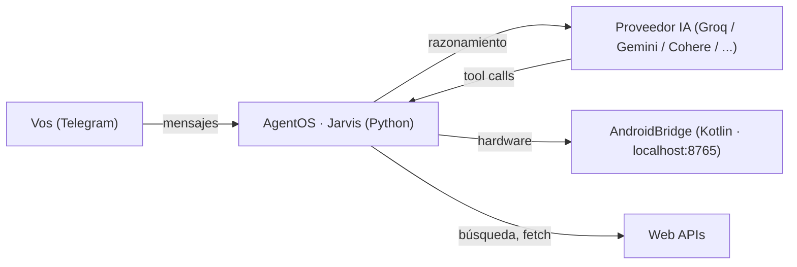

<div align="center">
  
  <h1>AgentOS</h1>
  <p>
    <strong>Un agente de IA 24/7 dentro de tu celular, controlado por Telegram.</strong><br>
    Para Android <strong>sin Google</strong>.
  </p>
  <p>
    
    
    
    
    
    
    
  </p>
  <p><em>Producto de <strong>Indaga Lab</strong> · basado en el bot Jarvis</em></p>
</div>

---

AgentOS mete un agente de IA en **Python embebido (Chaquopy / CPython 3.13)** dentro de una app Android nativa, corriendo **24/7 como servicio en primer plano**. Interactuás por **Telegram** — preguntás, controlás el teléfono, programás tareas, te avisa si te roban el celu. Multi-proveedor de IA (**Groq, Gemini, Cohere, Mistral, NVIDIA, SambaNova, OpenRouter, AI21**) con failover automático, todo corriendo **local en tu dispositivo**. minSdk 26 (Android 8+).

> **El nicho:** no competimos con los flagships con Google. Apuntamos al parque que **nadie atiende** — Huawei post-2019, ROMs de-Googled (LineageOS / GrapheneOS / e-OS), celulares chinos sin GMS. Enorme en LATAM. El ángulo no es *"para los que no tienen Android"* — es **"para los que no tienen Google"**.

## Features

| | Feature | Qué hace |
|---|---|---|
| 🤖 | **Motor de IA** | Multi-proveedor OpenAI-compatible: Groq, Gemini, Cohere, Mistral, NVIDIA, SambaNova, OpenRouter, AI21. **Failover automático** si uno se cae. Modos: normal, profe, coder, conciso. |
| 💬 | **Telegram** | Bot completo por long-polling (sin push de Google): teclados inline, notas de voz, fotos, PDFs, force-reply. |
| 📱 | **Control del teléfono** | Cámara, GPS, SMS, llamadas, linterna, TTS, vibración, portapapeles, sensores, micrófono — vía **AndroidBridge** HTTP en `localhost:8765` (sin Termux). |
| 🛡️ | **Antirrobo** | Detecta movimiento → toma selfie → la **IA identifica** si es el dueño o un intruso → manda **SMS + ubicación GPS** a tu contacto de emergencia. |
| 🧠 | **Memoria** | SQLite local: notas, recordatorios, listas con checkboxes, diario inteligente, memoria a largo plazo. |
| ⏰ | **Agenda** | Recordatorios en lenguaje natural ("recuérdame en 30 min"), mensajes programados (Telegram / SMS / WhatsApp-link), briefing matutino. |
| 🌐 | **Web** | Búsqueda en internet con fuentes, resumen de URLs, generación de imágenes, vigías de páginas. |
| 🎙️ | **Voz** | Transcribe notas de voz (Whisper) y puede responder hablando por el altavoz del teléfono. |
| ⚙️ | **Ajustes en vivo** | Cambia modelo o proveedor desde Telegram con `/model` y `/provider`, sin reabrir la app. |
| 🔑 | **Env Vars** | Pegas tus API keys desde la pantalla **Config** (una a una o en bloque estilo `.env`). Se guardan **cifradas** en el Android Keystore. |
| 🔋 | **24/7 de verdad** | Foreground service `START_STICKY` + wake lock + **autoarranque en boot** + **watchdog** que revive el agente si se cae. |
| 👥 | **Multi-usuario** | Whitelist de chats autorizados, roles **dueño** (todos los poderes) vs **invitado** (solo IA). |

<details>
<summary><strong>Arquitectura</strong></summary>

<br>



**Stack on-device:**

```
App Android (Kotlin + Jetpack Compose · Material 3)
 └─ AgentService — Foreground Service (START_STICKY + wake lock + Watchdog + BootReceiver)
     ├─ Python embebido (Chaquopy / CPython 3.13)
     │   ├─ jarvis.py        — entrypoint: start / stop / info / get_logs
     │   ├─ jarvis_core.py   — LLM multi-proveedor, loop Telegram, SQLite, scheduler, ~30 comandos
     │   └─ bridge_client.py — traduce los comandos termux-* a llamadas HTTP al bridge
     └─ AndroidBridge (NanoHTTPD · 127.0.0.1:8765) → cámara · GPS · SMS · llamadas · TTS · sensores · mic
```

Package: `com.indagalab.agentos`. Cáscara Android inspirada en [SeekerClaw](https://github.com/sepivip/SeekerClaw) (MIT); **runtime Python** (no Node.js) vía [Chaquopy](https://chaquo.com/chaquopy/) para reusar el bot Jarvis.

</details>

## Quick Start

**Requisitos:** JDK 17 · Android SDK 35 · Python 3.13 (para Chaquopy `buildPython`)

```bash
git clone https://github.com/DiegoFernandoLojanTenesaca/indaga-agentOS.git
cd indaga-agentOS
echo "sdk.dir=$HOME/android-sdk" > local.properties     # ruta de tu SDK
./gradlew :app:assembleDebug
adb install -r app/build/outputs/apk/debug/app-debug.apk
```

Abre la app → pestaña **Config** → pega tu **token de Telegram** ([@BotFather](https://t.me/BotFather)) + tus **API keys** (Groq, Gemini, etc. — la app te indica de dónde obtenerlas gratis) → **Guardar** → pestaña **Inicio** → **Iniciar agente**. El primer chat que le escriba al bot queda como **dueño** automáticamente.

> Guía completa de montaje en otra PC: [`docs/SETUP.md`](docs/SETUP.md) · Diseño y plan por fases: [`ARCHITECTURE.md`](ARCHITECTURE.md)

> **Beta** — en desarrollo activo. Espera bordes ásperos y cambios.

## Aviso de seguridad

AgentOS le da a una IA capacidades reales sobre tu teléfono — cámara, SMS, llamadas, ubicación. Ten en cuenta:

- **La IA se equivoca.** Los modelos alucinan y a veces hacen cosas no previstas. Verifica antes de confiar en salidas críticas.
- **Prompt injection es un riesgo real.** Contenido malicioso de webs, mensajes o archivos podría manipular al agente. Hay defensas, pero ningún sistema es a prueba de balas.
- **Tus claves viven en tu teléfono**, cifradas en el Keystore. No se suben a ningún lado salvo al proveedor de IA que elijas.
- **Eres responsable** de lo que hace tu agente. AgentOS es una herramienta, no un consejo.

## Créditos

Cáscara Android inspirada en [SeekerClaw](https://github.com/sepivip/SeekerClaw) (MIT) / OpenClaw. Runtime Python vía [Chaquopy](https://chaquo.com/chaquopy/). Bot **Jarvis** original sobre Termux, portado a AgentOS.

---

<div align="center">
  <sub>Hecho por <strong>Indaga Lab</strong> · Tu teléfono. Tu agente.</sub>
</div>
