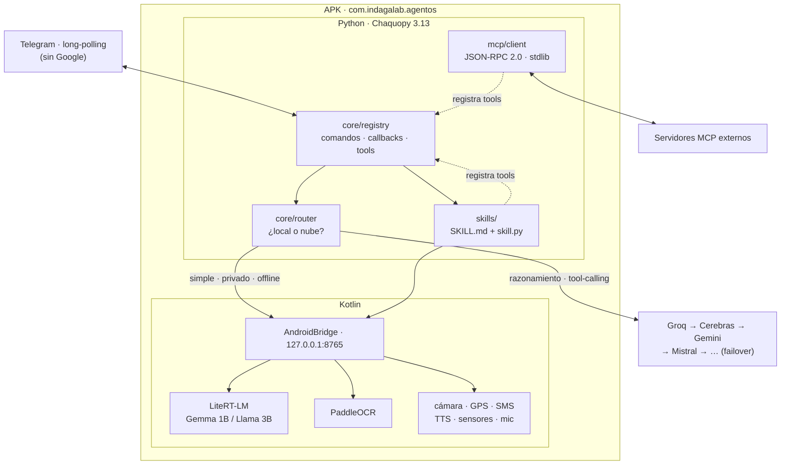

# AgentOS v0.3 — Investigación y plan de arquitectura

> Fecha: 2026-08-06 · Estado: propuesta, sin implementar
> Complementa `ARCHITECTURE.md` (v0.2). Base de investigación previa:
> `/mnt/disco1tb/PROYECTO/investigacion-ia-oss-2026.md` (2026-07-16)

---

## 0. Punto de partida

Lo implementado hoy funciona: multi-proveedor con failover, bridge de hardware,
servicio 24/7, UI Compose. Lo que **no** existe es el principio de diseño #2 de
`ARCHITECTURE.md` — *"core mínimo + todo lo demás como plugin"*:

| Prometido en `ARCHITECTURE.md` | Realidad en el código |
|---|---|
| §7 Skills Markdown+YAML | `skills/` contiene solo `.gitkeep` (29-may) |
| §7 MCP remote tools | cero menciones a MCP |
| "core mínimo" | `jarvis_core.py` = 1854 líneas, ~90 funciones |
| — | `handle()` = 351 líneas / **61 ramas `elif`** |
| — | `handle_callback()` = 238 líneas |
| — | `Screens.kt` = 1162 líneas (59% del Kotlin) |

**No se puede injertar nada de OpenClaw en un `elif` de 61 ramas.** Ese es el
cuello de botella real, y todo lo demás depende de resolverlo.

---

## 1. Investigación — hallazgos que deciden el diseño

### 1.1 MCP es JSON-RPC 2.0 → cliente propio, no el SDK

La spec obliga: *"All messages between MCP clients and servers MUST follow the
JSON-RPC 2.0 specification."* El SDK oficial (`mcp`, MIT, Python ≥3.10) arrastra
**pydantic**, cuyo `pydantic-core` es Rust compilado — **no hay wheel para Android
arm64 en Chaquopy**.

**Decisión:** escribir `mcp/client.py` a mano con `json` + `urllib` (stdlib).
Son ~200 líneas para `initialize`, `tools/list` y `tools/call`. Cero dependencias
nuevas, y el APK no engorda.

### 1.2 El formato de skills ya está estandarizado

Los Agent Skills de Claude Code son una carpeta con `SKILL.md` y frontmatter YAML:

```yaml
---
name: deploy
description: Qué hace y cuándo usarlo
argument-hint: "[destino]"
disable-model-invocation: true
allowed-tools: Bash, Read
---
Cuerpo en markdown con las instrucciones.
```

Es el mismo formato que pide `ARCHITECTURE.md` §7. **Adoptarlo tal cual** permite
portar skills escritos para Claude Code o OpenClaw sin traducción — que es
exactamente el objetivo de "no depender de un solo upstream".

**Decisión:** el frontmatter se parsea a mano (~30 líneas: son pares `clave: valor`
y listas simples). No hace falta PyYAML.

### 1.3 Modelos locales: qué entra de verdad en el P40

Medido en el equipo: 5,8 GB totales, **3,4 GB disponibles**.

| Modelo | Q4 | ¿Entra? |
|---|---|---|
| Gemma 3 1B int4 (LiteRT) | 529 MB | ✅ holgado |
| Llama 3.2 3B / Qwen3 1.7B | ~1,9 GB | ✅ |
| **Hermes 3 Llama 3.2 3B GGUF** | ~2 GB | ✅ justo |
| Hermes **4** (mínimo 14B) | ~8 GB | ❌ |
| **Bonsai 27B 1-bit** | 3,9 GB | ❌ ver 1.4 |

### 1.4 Bonsai 27B: descartado, pero su tesis se adopta

PrismML publica pesos Apache 2.0, pero: *"runs natively on Apple devices via MLX
and on NVIDIA GPUs via CUDA, through custom low-bit kernels"*. **No hay kernel para
Mali/Android**, y sin kernel los pesos no sirven. Además su gate de memoria asume
un iPhone de 12 GB (~6 GB para la app); el P40 da 3,4 GB.

Lo que **sí** se adopta es su arquitectura: *"hybrid deployments that route
non-frontier and privacy-sensitive tasks to a capable local model and reserve
frontier cloud models for the hardest steps"*. Eso es el §2.2 de este plan.

**⚠️ Matiz importante (verificado en el P40, 2026-08-06):** lo descartado es el
**27B**, no la familia. PocketPal ofrece **Bonsai 1.7B en 248 MB** listo para
Android — cuantización extrema de PrismML corriendo sobre llama.cpp. O sea: la
tecnología Bonsai **sí llega al teléfono**, en el tamaño que el teléfono aguanta.
Es candidato serio para el modelo local del router (§2.2) por relación
tamaño/capacidad: 248 MB contra los 1,9 GB de Hermes 3B.

Catálogo on-device que PocketPal lista hoy, todo descargable y ejecutable en el P40:

| Modelo | Tamaño |
|---|---|
| LFM2.5 350M | 229 MB |
| **Bonsai 1.7B** | **248 MB** |
| Qwen3 0.6B | 484 MB |
| Gemma 3 1B | 806 MB |

### 1.5 Runtime local: Kotlin, no Python

Chaquopy hoy solo instala `requests`, `Pillow`, `pypdf`. **llama.cpp no es
empaquetable ahí** (requiere compilación nativa + JNI). En cambio:

- **LiteRT-LM** (Google, Apache 2.0) tiene API **Kotlin estable** para Android,
  soporta Gemma/Llama/Phi-4/Qwen y es el sucesor oficial de MediaPipe LLM
  (que quedó en maintenance-only).
- El `AndroidBridge` **ya existe** y ya habla HTTP con Python.

**Decisión:** el modelo local vive en Kotlin y se expone como
`POST /llm/local` en el bridge. Python lo consume como un proveedor más del
failover que ya está escrito. No hay que tocar el motor LLM.

### 1.6 Restricciones heredadas de la investigación previa

- **El límite es la batería, no la RAM**: ~0,7 J/token ⇒ ~2 h de conversación
  continua. Diseñar el modelo local para **ráfagas**, nunca always-on.
- **Groq recortó su free tier ~93%**: 1.000 req/día, ~30 RPM. El stacking con
  fallback deja de ser lujo y pasa a ser obligatorio.
- **Cerebras**: 1M tok/día pero **contexto tope 8K** — no sirve para prompts largos.
- **Qwen3-Embedding 0.6B** (Apache 2.0) es la opción para RAG on-device si algún
  día se añade memoria semántica.

### 1.7 OCR y voz — solo uno es hueco real

Auditado el código actual antes de proponer nada:

| Capacidad | Estado hoy | ¿Hace falta algo? |
|---|---|---|
| **TTS** | `speak()` → bridge `/tts` = TTS **nativo de Android, offline, sin Google** | **No.** Ya está resuelto y es gratis. Piper daría mejor voz a cambio de +50 MB: no compensa. |
| **STT** | `transcribe()` → **Groq Whisper large-v3** por API | Funciona, pero exige internet y consume el free tier recortado. Local (whisper.cpp tiny/base) solo aporta **offline + privacidad**. |
| **OCR** | **cero menciones en el código** | **Sí. Es el único hueco real.** |

**OCR — decisión: PaddleOCR.** ML Kit da buena precisión pero **depende de Google
Play Services**, lo que viola el principio #1. Los puertos de Tesseract para Android
están anticuados y su precisión es pobre. PaddleOCR corre offline, sin GMS, con
buena precisión y multi-idioma.

Casos de uso que abre: leer recibos y facturas, extraer texto de capturas, digitalizar
documentos, resolver el "¿qué dice esta foto?" sin mandar la imagen a una vision API
(que hoy es la única vía y cuesta tokens).

Se expone como `POST /ocr` en el bridge, igual que el resto del hardware.

**STT local — opcional, fase posterior.** whisper.cpp `tiny`/`base` en Kotlin junto a
LiteRT-LM. Nota: **FUTO Voice Input ya está instalado en el P40** y es whisper
on-device funcionando como teclado — sirve para dictar hoy mismo sin escribir código.

---

## 2. Arquitectura propuesta

### 2.1 Estructura

```
app/src/main/python/
├── jarvis.py                    # entrypoint (sin cambios)
├── core/
│   ├── registry.py              # ← NUEVO  comandos/callbacks/tools por decorador
│   ├── router.py                # ← NUEVO  decide local vs nube
│   ├── config.py                # load_env, allowed_ids, STATE, PROVIDERS, MODES
│   ├── db.py                    # db, bump_activity, activity_map
│   ├── llm.py                   # call, llm, sysprompt, agent_run, run_tool
│   ├── telegram.py              # tg, send, kb, force_reply…
│   ├── hardware.py              # ← API directa al bridge (mata el shim de shell)
│   └── scheduler.py             # scheduler + check_*
├── skills/
│   ├── loader.py                # ← NUEVO  descubre y registra skills
│   └── builtin/                 # los 61 comandos migrados por dominio
│       └── {ia,telefono,agenda,antirrobo,listas,web}/
└── mcp/
    └── client.py                # ← NUEVO  JSON-RPC 2.0 sobre stdlib
```

En Kotlin, `AndroidBridge` gana un endpoint `/llm/local` respaldado por LiteRT-LM,
y `Screens.kt` (1162 líneas) se parte por pantalla.

### 2.1.b Diagrama



Las tres flechas punteadas son la clave: **skills y MCP se registran en el mismo
sitio que los comandos internos**. Para el motor del agente, una herramienta traída
de un servidor MCP y un comando propio son indistinguibles. Eso es lo que hace el
sistema injertable.

### 2.2 Router híbrido — corregido con medición real

**Medición en el P40 Lite (Kirin 810 · 8 cores · 5,6 GB), 2026-08-06, PocketPal:**

| Modelo | Tamaño | tok/s | ms/token | TTFT | Español | Contenido |
|---|---|---|---|---|---|---|
| **Qwen3 0.6B** | 478 MB | **30,24** | **33** | **5.008 ms** | ✅ correcto | ⚠️ divaga |
| Llama 3.2 1B | 771 MB | 9,37 | 107 | 9.932 ms | ✅ correcto | ✅ correcto |
| Bonsai 1.7B | 242 MB | 7,63 | 131 | 7.228 ms | ❌ **vietnamita** | ❌ |
| LFM2.5 350M | 227 MB | *no medido* | | | | |
| Gemma 3 1B | 806 MB | *no medido* | | | | |

**Ganador: Qwen3 0.6B.** 3× más rápido que Llama 1B siendo 40% más pequeño, y con
español correcto. Su defecto (divagar, confundir la intención) se mitiga con system
prompt estricto y `max_tokens` bajo — es un 0.6B, no se le puede pedir criterio.
Desactivar el modo *Think*: infla el TTFT de 5 s a 14 s sin aportar en tareas simples.

**Bonsai 1.7B descartado.** Cuantizar 1,7B a 242 MB se llevó el multilingüe: responde
en vietnamita a prompts en español. Los benchmarks de PrismML son del 27B, no de este.

**⚠️ Hallazgo: la GPU no se usa.** El Benchmark integrado aborta (`Total Time: 99 ms`,
t/s vacíos) con `GPU Layers: 99`. llama.cpp no tiene backend funcional para **Mali-G52**,
así que todo corre en **CPU con 6 threads**. Consecuencias: (a) las cifras de arriba son
el techo real, no hay aceleración pendiente de activar; (b) el consumo de batería es el
de CPU a full, que es el peor caso del límite de ~0,7 J/token.

### 🔑 El hallazgo decisivo: stateless vs. conversacional

Mismo modelo (Qwen3 0.6B), **mismo prompt**, distinto contexto acumulado:

| Escenario | TTFT | tok/s | Respuesta |
|---|---|---|---|
| Chat con 3 turnos de historial | **19.494 ms** | 13,09 | verbosa, 3 viñetas |
| **Chat limpio, prompt corto** | **730 ms** | 17,65 | `Clasificado como NORMAL. Código: 4821.` |

**26× de diferencia solo por el historial.** El TTFT es tiempo de *prefill*: reprocesa
todo el contexto en cada llamada. Progresión medida en un mismo chat:
5.008 → 13.925 → 19.494 ms.

**Esto rehabilita el modelo local.** Una tarea stateless completa tarda
`0,73 s + 12 tokens × 0,057 s` ≈ **1,4 segundos**. Es usable incluso en flujos donde
alguien espera, no solo en background.

⇒ **Regla de arquitectura:** el modelo local NO es un chat, es una **función**.
Se invoca con prompt corto, sin historial, salida acotada. Cada llamada nace y muere.
Si se le pasa conversación acumulada, se degrada 26× y deja de servir.

**Calidad verificada en tarea real** (clasificar SMS + extraer OTP): correcta en formato
y extracción. ⚠️ Pero **inconsistente entre ejecuciones**: el mismo SMS salió `URGENTE`
con historial y `NORMAL` sin él. Un 0.6B no tiene criterio propio ⇒ el system prompt
debe definir la regla de decisión explícitamente, nunca dejarla al modelo.

Referencia nube: Groq ≈ **320 tok/s**, TTFT ≈ 200 ms. Es **42× más rápido generando
y 36× más rápido arrancando**.

**Lo que esto cambia:** los 7,2 s de TTFT son tiempo de *prefill* — procesar el
prompt antes de emitir el primer token. En un chip sin NPU aprovechable eso no se
arregla con un modelo más pequeño. Una respuesta de 150 tokens tarda
`7,2 s + 150 × 0,131 s` ≈ **27 segundos**.

Router definitivo (corregido tras medir stateless):

| Tarea | Destino | Latencia real | Motivo |
|---|---|---|---|
| Clasificar SMS / detectar OTP / extraer dato | **local** | **~1,4 s** | stateless, corto, privado |
| Extraer fecha-hora de un recordatorio | **local** | ~1,4 s | idem |
| Decidir si una notificación es urgente | **local** | ~1,4 s | idem |
| Resumir para el briefing (madrugada) | **local** | asíncrono | nadie espera |
| Foto del antirrobo sin red | **local** | asíncrono | único camino |
| **Conversar en Telegram** | **nube** | — | necesita historial ⇒ local se degrada 26× |
| Razonamiento multi-paso, tool-calling, visión | **nube** | — | los <8B no sostienen loops (refutado `0-3`) |

La frontera **no** es síncrono vs. asíncrono, ni simple vs. complejo:
es **stateless vs. conversacional**.

**Sobre Bonsai 1.7B:** descartado para AgentOS. Cuantizar 1,7B a 248 MB se llevó por
delante el multilingüe: mezcla vietnamita en respuestas en español. Los benchmarks de
PrismML son sobre el 27B, no sobre este.

### 2.3 Contrato de skill

```
skills/telefono/
├── SKILL.md          # frontmatter + doc que ve el LLM
└── skill.py          # @command("/foto") …
```

`SKILL.md` usa el formato estándar más dos campos propios:

```yaml
---
name: telefono
description: Cámara, GPS, batería, linterna y SMS del dispositivo
role: owner            # owner | invitado   (mapea a UserWhitelist)
requires-env: []       # claves que necesita; si faltan, se desactiva limpio
---
```

El loader escanea `skills/*/SKILL.md`, lee el frontmatter, importa `skill.py` si
existe y registra lo que traiga. Un skill sin sus env vars se desactiva con un
aviso, no rompe el arranque.

---

## 3. Plan por pasos

Cada paso es reversible, verificable, y deja la app funcionando.

**Paso 1 — Registro. ✅ HECHO (2026-08-06).**
`core/registry.py` + `handle()` consulta el registro **antes** de la cadena de `elif`,
que sigue intacta y se irá vaciando. Enfoque incremental: los skills quedan
desbloqueados ya, sin reescribir 61 ramas de golpe.
- Migrados como prueba del patrón: `/bateria`, `/linterna`, `/pega` (61 → 60 elif).
- `test_registry.py`: 8 checks, incluido uno de integración que llama a `handle()` real.
- Verificado: compila, instala y arranca en el P40; `core/registry.pyc` **sí** viaja
  dentro de `assets/chaquopy/app.imy` ⇒ despejado el riesgo "Chaquopy y subpaquetes".

**Lecciones del Paso 1** (aplican a los pasos 2-3):
1. **El permiso vive en dos sitios.** `OWNER_ONLY` (set global) y `owner=` del registro.
   Al migrar hay que **sacar el comando de `OWNER_ONLY`** y declarar `owner=True` en el
   decorador, o se pierde silenciosamente la restricción. Lo cazó el test de integración:
   `/bateria` era owner-only y se registró sin serlo.
2. **`test_registry.pyc` se empaqueta en el APK** (~10 KB de peso muerto en release).
   Excluirlo del `sourceSets` de release cuando haya más tests.
3. **Build:** el init script global `~/caches/gradle/init.d/notifee-local.gradle` (de
   Sudial mobile) rompe este build con *"prefer settings repositories"*. Solución sin
   tocar Sudial: `GRADLE_USER_HOME=/tmp/gradle-agentos ./gradlew ...` con symlinks a
   `caches/`, `wrapper/`, `native/`, `jdks/` del home real.
4. **Sin verificar:** el arranque del bot en el dispositivo requiere token de Telegram.
   El import de `core.registry` está probado en escritorio y el `.pyc` está en el APK,
   pero el runtime completo en Chaquopy queda pendiente de una prueba con token real.

**Paso 2 — Partir el core** en `core/*` guiado por el registro. Mecánico.

**Paso 3 — Loader de skills. ✅ HECHO (2026-08-06).**
`skills/loader.py` descubre `*/SKILL.md`, parsea el frontmatter a mano (sin PyYAML)
e importa `skill.py`, que se registra solo vía `@registry.command`.
- Primer skill real: `skills/telefono/` con `/foto /selfie /ubicacion /bateria
  /linterna /copia /pega`. 61 → **55 ramas `elif`**.
- **Dos orígenes**: los del APK y los de `AGENTOS_HOME/skills` ⇒ se pueden añadir
  capacidades **sin recompilar**. Un skill del usuario no puede suplantar a uno del APK.
- Garantías probadas: un skill roto no tumba el arranque **ni deja comandos a medias**
  (se revierte el registro); `requires-env` lo desactiva limpio; `enabled: false` lo
  salta; un skill sin `skill.py` (solo documentación para el LLM) es válido.
- `test_loader.py`: 10 checks. Total del proyecto: **18**.
- Verificado: compila, instala y arranca; **`skills/telefono/SKILL.md` viaja dentro
  del APK** (Chaquopy sí empaqueta archivos no-Python).

⚠️ **Chaquopy extrae los assets bajo demanda** — `files/chaquopy/AssetFinder/app/`
está vacío hasta que algo importa. Por eso `discover()` tiene un plan B con
`importlib.resources` cuando `os.listdir()` del paquete devuelve vacío. **No
verificado en runtime real** (arrancar el bot exige token de Telegram): si algún día
se comprueba que `os.listdir()` basta en Android, esa segunda rama sobra y se borra.

**Paso 4 — Cliente MCP** (`mcp/client.py`) y registro de sus tools en el mismo
registry. Verificación: conectar a un servidor MCP real y listar tools.

**Paso 5 — `hardware.py`**: eliminar el round-trip `string de shell → shlex → HTTP`.
Ese viaje causó el bug de acentos del commit `939db70`.

**Paso 6 — Modelo local**: LiteRT-LM en Kotlin + `POST /llm/local` + router.

**Paso 7 — UI.** 🔶 EN CURSO.

*Hecho (2026-08-06):*
- **Bug de diseño corregido:** el tema definía `primary`/`secondary`/`tertiary` pero
  **no los `*Container`**. Material 3 rellenaba con su lavanda de fábrica, y ese
  púrpura salía en el botón principal y en el item activo de la barra inferior,
  chocando con toda la paleta cálida de Indaga. Añadidos `secondaryContainer`,
  `tertiaryContainer` y `errorContainer` (+ sus `on*`) en claro y oscuro.
- **`ui/theme/Type.kt`**: escala tipográfica propia. Titulares Bold con tracking
  negativo, cuerpo con interlínea holgada, labels con tracking positivo.
  **Sin ficheros de fuente**: cada TTF son ~300 KB sobre un APK de 33 MB, y el
  carácter sale de pesos y proporciones.

*Pendiente:*
- Partir `Screens.kt` (1162 líneas: 8 pantallas + ~12 componentes) en
  `ui/screens/` y `ui/components/`.
- **Material 3 Expressive real** exige subir el BOM: el proyecto usa
  `compose-bom 2024.12.01` y las APIs Expressive (`MaterialExpressiveTheme`,
  motion schemes) llegaron en material3 1.4.x (2025). Hoy solo se imita el estilo
  con `Shapes` redondeadas. Subir el BOM es un cambio con riesgo propio: hacerlo
  aislado y verificando cada pantalla.

---

## 4. Riesgos

- **Sin tests.** El repo no tiene ni uno. Partir 1854 líneas sin red es temerario:
  el `test_registry.py` del paso 1 es requisito, no adorno.
- **Chaquopy y las importaciones relativas**: verificar que los subpaquetes se
  empaquetan bien en el APK antes del paso 2.
- **LiteRT-LM es joven**: si su API Kotlin da problemas, el fallback es quedarse
  solo con nube — el router lo absorbe sin cambios de arquitectura.
- **Batería**: el modelo local debe ser opt-in y por ráfagas, o el 24/7 muere.
- **Sensibilidad temporal**: los free tiers cambian rápido (Groq −93% en un año).
  Revalidar límites antes de depender de un proveedor.

---

## 5. Preguntas abiertas heredadas

De `investigacion-ia-oss-2026.md`, siguen sin respuesta y afectan a este plan:

1. Comparativa real tok/s: LiteRT-LM vs llama.cpp vs MLC-LLM vs ExecuTorch en
   hardware concreto. **Medible ya**: ChatterUI y PocketPal están instalados en el P40.
2. Tool-calling fiable con modelos <8B on-device: sin datos confiables.
3. STT/TTS OSS y vector stores: frente entero sin cubrir.
